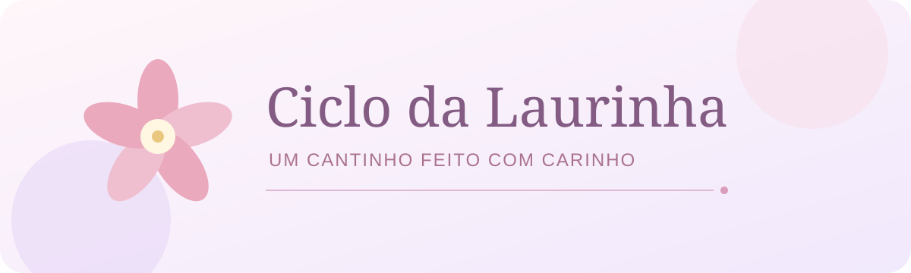

### Um cantinho para acompanhar cada fase, com carinho e simplicidade.

**🌷 Android &nbsp; · &nbsp; 📴 Offline &nbsp; · &nbsp; 📅 Calendário &nbsp; · &nbsp; 💗 Diário pessoal**

Portfólio do aplicativo · Versão documentada: 1.4.0 (V11)

---

## 💌 Como nasceu

Criei o **Ciclo da Laurinha** pensando na minha filha. Ao procurar um aplicativo para uma pré-adolescente começar a acompanhar o ciclo menstrual, encontrei opções que incluíam assuntos e campos sobre sexualidade e gravidez. Eu queria, para este momento da vida dela, uma experiência mais simples, acolhedora e adequada ao que nossa família precisava.

Daí nasceu um espaço para registrar datas, sentimentos e pequenas anotações do dia a dia. A proposta é ajudar a Laurinha a se organizar e se conhecer, no seu tempo, com privacidade e sem publicidade.

> 🌸 **Uma ideia de pai:** tecnologia também pode ser um gesto de cuidado.

## ✨ O que o aplicativo oferece

| Recurso | Para que serve |
|:---|:---|
| 📅 Calendário | Acompanhar os dias registrados e consultar o ciclo |
| 🌷 Histórico | Rever datas de início e término dos ciclos |
| 💭 Sentimentos e mini diário | Guardar como foi o dia e escrever pequenas anotações |
| 🔔 Lembrete opcional | Avisar um dia antes da próxima data prevista, às 9h, quando houver previsão e permissão de notificações |
| 💾 Backup local | Exportar e restaurar os dados por meio de um arquivo escolhido no celular |
| 🔐 PIN e código dos responsáveis | Controlar o acesso ao aplicativo e oferecer recuperação do PIN |
| 🎨 Temas suaves | Escolher entre rosa, lavanda, pêssego e menta |
| 📴 Uso offline | Consultar e registrar informações sem uma conta ou conexão com a internet |

O lembrete usa uma **estimativa baseada nos ciclos registrados**. A data pode variar; ela não é uma certeza nem substitui orientação de um profissional de saúde.

## 🎀 Feito para ser leve

O visual usa cores suaves, ilustrações da Laurinha e uma abertura breve. A navegação reúne calendário, histórico, registros do dia e configurações. O aplicativo foi pensado como um cantinho pessoal, sem transformar uma etapa natural da vida em algo complicado.

🌼 &nbsp; 🌷 &nbsp; 🌼

*Cada dia tem o seu jeito. Aqui, todos cabem com carinho.*

## 🔒 Cuidado com os dados

As informações ficam no dispositivo, e o aplicativo funciona offline. O backup é um **arquivo JSON criado no local escolhido pela pessoa**; ele inclui registros, anotações, PIN e código dos responsáveis. Esse arquivo deve ser guardado com cuidado, pois **não é criptografado**. Restaurá-lo substitui os dados atuais após confirmação.

O PIN ajuda a controlar o acesso pela interface, mas não deve ser entendido como criptografia dos dados. O aplicativo não usa sincronização automática. Saiba mais em [privacidade e limites](docs/privacidade.md).

## 🧩 Por dentro do projeto

| Tecnologia | Papel no aplicativo |
|:---|:---|
| Kotlin e Jetpack Compose | Telas e interações do Android |
| Material 3 | Componentes e temas da interface |
| Room | Armazenamento local dos ciclos e registros diários |
| DataStore | Preferências, PIN e configurações |
| Notificações Android | Lembrete opcional do próximo ciclo |
| Gradle | Organização e compilação do projeto Android |

**Base consultada:** projeto V11, com versão interna **1.4.0**, `minSdk 26` (Android 8.0) e `targetSdk 36`. A descrição acima foi conferida no projeto; esta publicação não afirma teste em todos os aparelhos ou revisão clínica da previsão.

## 👨‍👧 Concepção

**David dos Santos Boneli** idealizou o aplicativo, definiu suas necessidades, acompanhou o visual e orientou a evolução a partir do uso da família. A implementação e a documentação tiveram assistência de inteligência artificial.

## 📚 Sobre este repositório

Este repositório apresenta o projeto como **portfólio público**. O código-fonte, o APK, as capturas pessoais, os históricos e os backups não são publicados aqui. Os desenhos do aplicativo podem ser apresentados futuramente depois de uma revisão de privacidade e direitos.

Leia também [Privacidade e limites](docs/privacidade.md) e [Direitos](DIREITOS.md).

---

Feito com carinho para a Laurinha. 🌷

